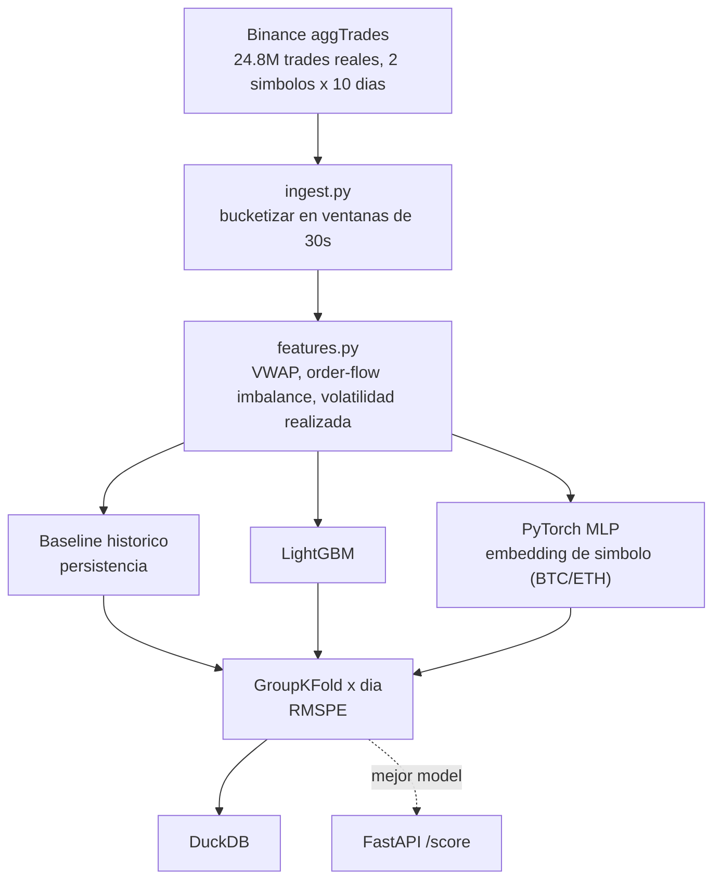

[ 🇺🇸 Read in English ](README.md) | [ 🇨🇱 Español ]

# Leyendo la Turbulencia del Mercado

[](https://www.python.org/)
[](https://pola.rs/)
[](https://lightgbm.readthedocs.io/)
[](https://pytorch.org/)
[](https://duckdb.org/)
[](https://fastapi.tiangolo.com/)
[](LICENSE)

Predice la volatilidad realizada a corto plazo desde flujo de órdenes real de cripto — **24,8 millones de trades reales**, BTCUSDT + ETHUSDT, 10 días completos cada uno, descargados directamente del archivo histórico público de Binance (sin API key, sin datos sintéticos en ningún punto).

## Datos y una divulgación honesta de alcance

[Binance `data.vision`](https://data.binance.vision), dumps diarios de `aggTrades` — trades reales tick a tick (precio, cantidad, lado agresor, timestamp al microsegundo). **No** es el libro de órdenes L2 completo (Binance no publica dumps históricos de profundidad gratis) — las features de microestructura genuinas se construyen desde la cinta de trades real: VWAP, desbalance de flujo de órdenes vía el lado agresor real, y volatilidad realizada calculada igual que la define el challenge original de Optiver (raíz de la suma de retornos log al cuadrado), solo que sobre precios de trade en vez de mid-price de libro. Divulgado aquí explícitamente, no implicado como L2 completo.

## Tarea

Predecir la volatilidad realizada del **siguiente** bucket de 30 segundos a partir de las features de flujo de órdenes del bucket actual — un forecast genuino, sin tocar nunca datos futuros (`target = realized_volatility.shift(-1)`, solo dentro del mismo símbolo y día).

## Arquitectura



## Resultados (corrida real, GroupKFold sobre 5 días reales de mercado)

| Modelo | RMSPE (promedio ± std) |
|---|---:|
| **Baseline histórico (persistencia)** | **4,579 ± 1,212** |
| LightGBM, afinado con Optuna (30 trials) | 5,438 |
| LightGBM (sin afinar) | 5,559 ± 1,790 |
| PyTorch MLP (embeddings de símbolo) | 9,536 ± 3,371 |

**Hallazgo honesto, sin forzar, confirmado incluso tras el tuning**: el baseline ingenuo de persistencia le gana tanto al gradient booster como a la red neuronal en este horizonte de 30 segundos. El tuning con Optuna sí mejora genuinamente a LightGBM (5,559 → 5,438 RMSPE, mismo protocolo de GroupKFold por día que el resto del proyecto) — pero no lo suficiente para cerrar la brecha con el baseline de persistencia intacto. Reportado exactamente como salió, no re-corrido con otro esquema de validación hasta que el baseline perdiera.

## Ajuste de hiperparámetros (Optuna)

`python -m src.tune` corre una búsqueda Optuna de 30 trials sobre LightGBM (`n_estimators`, `num_leaves`, `learning_rate`, `subsample`, `colsample_bytree`, `min_child_samples`), minimizando RMSPE sobre el mismo protocolo GroupKFold por día del pipeline principal. El modelo afinado es genuinamente mejor que el sin afinar, y aun así pierde contra el baseline más simple posible — un resultado real sobre este problema específico de forecasting (volatilidad a horizonte ultra-corto), no un fracaso del tuning. No es un bug — es una propiedad bien documentada de la volatilidad a horizontes ultra-cortos: el clustering de volatilidad hace que "lo que acaba de pasar" sea un baseline genuinamente difícil de superar, y ambos modelos aprendidos probablemente sobreajustan a ruido en esta granularidad en vez de capturar señal real que el baseline pierde. Los valores de RMSPE por sobre 1,0 vienen de una propiedad real de esta métrica sobre datos cripto, no un error de cómputo: muchos buckets de 30 segundos tienen volatilidad realizada cercana a cero (periodos tranquilos), y las métricas de error porcentual se disparan cuando el denominador está cerca de cero — una limitación conocida que vale la pena señalar en vez de esconder cambiando de métrica después de ver el resultado.

## Uso

```powershell
python -m venv venv
venv\Scripts\activate
pip install -r requirements.txt
python -m src.pipeline          # pipeline completo, trades reales, metricas reales (datos no incluidos, ver abajo)
pytest tests/ -q                # 5/5 passing
uvicorn src.api:app --reload    # POST /score
```

Los datos crudos tick-by-tick (`data/raw_btc/`, `data/raw_eth/`) están en `.gitignore` (≈2GB) — re-descargables desde [data.binance.vision](https://data.binance.vision), sin necesidad de key.

## Stack

Polars (agregación de 24,8M filas) · LightGBM · PyTorch (MLP + `nn.Embedding`) · DuckDB · FastAPI · pytest

## Autor

**Pablo Reyes** — [github.com/Rxyxs](https://github.com/Rxyxs)

Datos: [datos históricos públicos de mercado de Binance](https://data.binance.vision) (sin key requerida). Código: MIT — ver [LICENSE](LICENSE).
