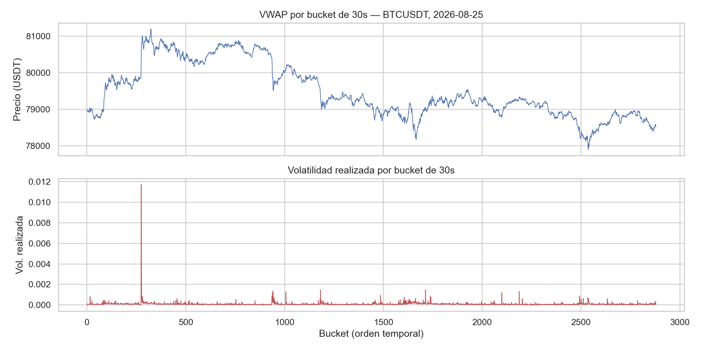
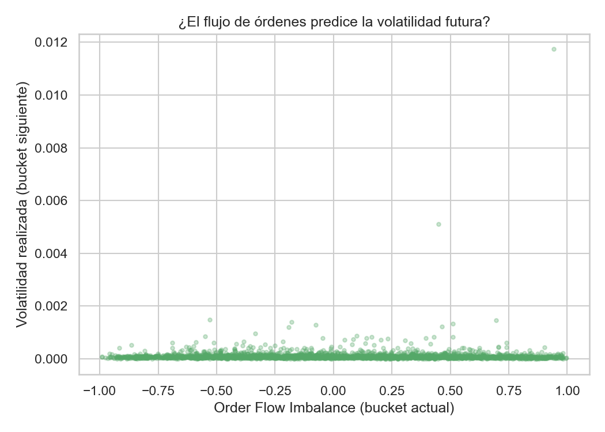
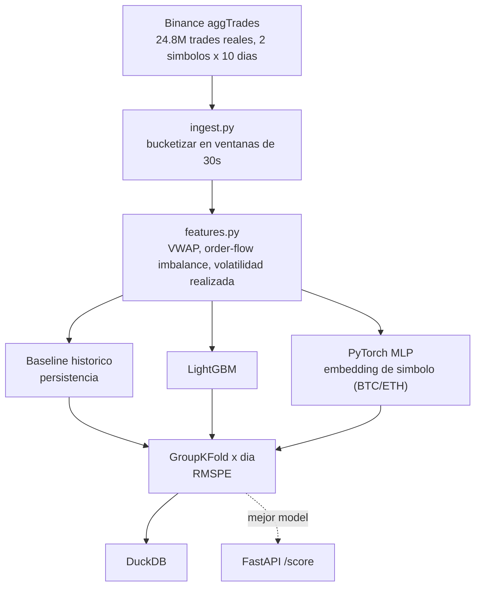
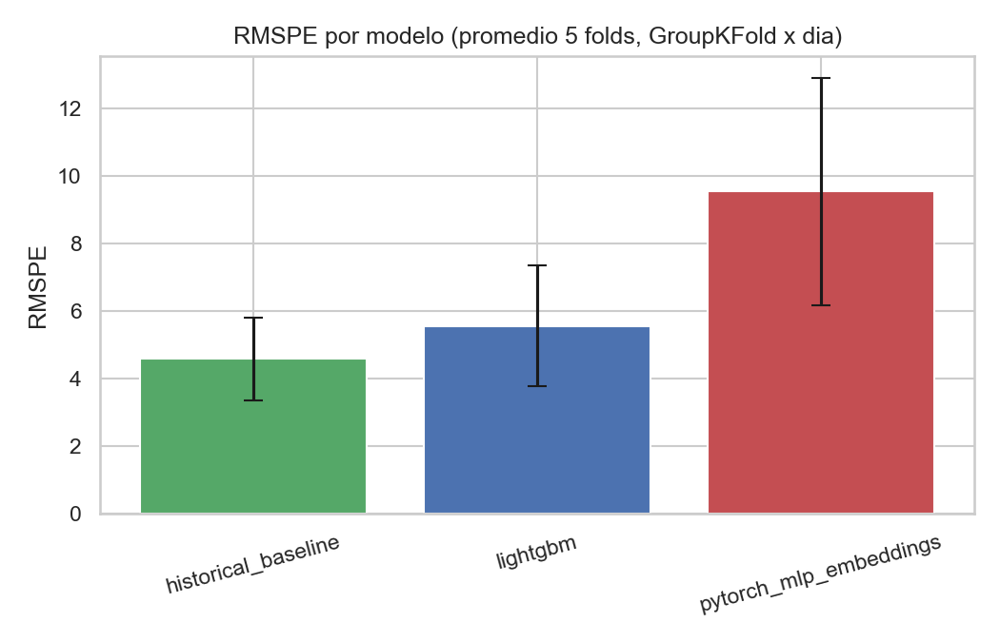
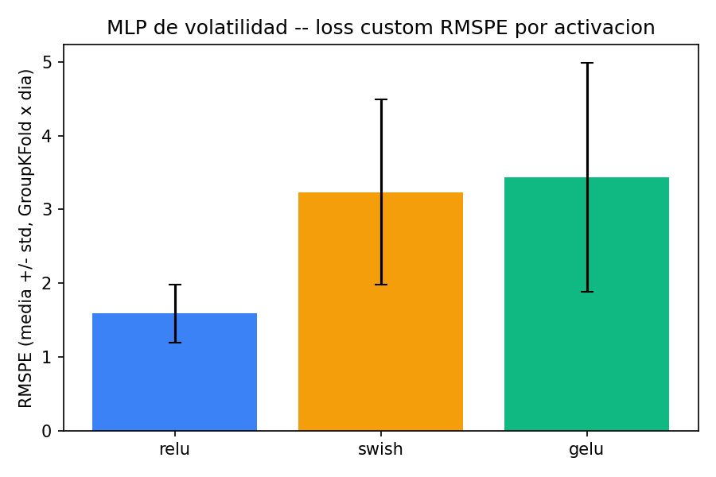

[ 🇺🇸 Read in English ](README.md) | [ 🇨🇱 Español ]

# Leyendo la Turbulencia del Mercado

[](https://github.com/Rxyxs/reading-market-turbulence/actions/workflows/tests.yml)
[](https://www.python.org/)
[](https://pola.rs/)
[](https://lightgbm.readthedocs.io/)
[](https://pytorch.org/)
[](https://duckdb.org/)
[](https://fastapi.tiangolo.com/)
[](go/streamer.go)
[](LICENSE)

Predice la volatilidad realizada a corto plazo desde flujo de órdenes real de cripto — **24,8 millones de trades reales**, BTCUSDT + ETHUSDT, 10 días completos cada uno, descargados directamente del archivo histórico público de Binance (sin API key, sin datos sintéticos en ningún punto).

## Datos y una divulgación honesta de alcance

[Binance `data.vision`](https://data.binance.vision), dumps diarios de `aggTrades` — trades reales tick a tick (precio, cantidad, lado agresor, timestamp al microsegundo). **No** es el libro de órdenes L2 completo (Binance no publica dumps históricos de profundidad gratis) — las features de microestructura genuinas se construyen desde la cinta de trades real: VWAP, desbalance de flujo de órdenes vía el lado agresor real, y volatilidad realizada calculada igual que la define el challenge original de Optiver (raíz de la suma de retornos log al cuadrado), solo que sobre precios de trade en vez de mid-price de libro. Divulgado aquí explícitamente, no implicado como L2 completo.

## Tarea

Predecir la volatilidad realizada del **siguiente** bucket de 30 segundos a partir de las features de flujo de órdenes del bucket actual — un forecast genuino, sin tocar nunca datos futuros (`target = realized_volatility.shift(-1)`, solo dentro del mismo símbolo y día).




## Arquitectura



## Resultados (corrida real, GroupKFold sobre 5 días reales de mercado)

| Modelo | RMSPE (promedio ± std) |
|---|---:|
| **Baseline histórico (persistencia)** | **4,579 ± 1,212** |
| LightGBM, afinado con Optuna (30 trials) | 5,438 |
| LightGBM (sin afinar) | 5,559 ± 1,790 |
| PyTorch MLP (embeddings de símbolo) | 9,536 ± 3,371 |

**Hallazgo honesto, sin forzar, confirmado incluso tras el tuning**: el baseline ingenuo de persistencia le gana tanto al gradient booster como a la red neuronal en este horizonte de 30 segundos. El tuning con Optuna sí mejora genuinamente a LightGBM (5,559 → 5,438 RMSPE, mismo protocolo de GroupKFold por día que el resto del proyecto) — pero no lo suficiente para cerrar la brecha con el baseline de persistencia intacto. Reportado exactamente como salió, no re-corrido con otro esquema de validación hasta que el baseline perdiera.



## Ajuste de hiperparámetros (Optuna)

`python -m src.tune` corre una búsqueda Optuna de 30 trials sobre LightGBM (`n_estimators`, `num_leaves`, `learning_rate`, `subsample`, `colsample_bytree`, `min_child_samples`), minimizando RMSPE sobre el mismo protocolo GroupKFold por día del pipeline principal. El modelo afinado es genuinamente mejor que el sin afinar, y aun así pierde contra el baseline más simple posible — un resultado real sobre este problema específico de forecasting (volatilidad a horizonte ultra-corto), no un fracaso del tuning. No es un bug — es una propiedad bien documentada de la volatilidad a horizontes ultra-cortos: el clustering de volatilidad hace que "lo que acaba de pasar" sea un baseline genuinamente difícil de superar, y ambos modelos aprendidos probablemente sobreajustan a ruido en esta granularidad en vez de capturar señal real que el baseline pierde. Los valores de RMSPE por sobre 1,0 vienen de una propiedad real de esta métrica sobre datos cripto, no un error de cómputo: muchos buckets de 30 segundos tienen volatilidad realizada cercana a cero (periodos tranquilos), y las métricas de error porcentual se disparan cuando el denominador está cerca de cero — una limitación conocida que vale la pena señalar en vez de esconder cambiando de métrica después de ver el resultado.

## Comparación de activaciones con loss custom (PyTorch)

`python -m src.activation_experiment` reutiliza la tabla de features ya persistida en DuckDB (generada por `python -m src.pipeline`) y reentrena la misma `VolatilityMLP` con una **loss custom** (`rmspe_loss`, en `src/modeling.py`) que optimiza directamente la métrica de evaluación del proyecto en vez de MSE plano — coherente con por qué RMSPE y no RMSE se usa para reportar resultados: la volatilidad realizada varía en órdenes de magnitud entre regímenes calmos y turbulentos, y MSE pondera esos regímenes de forma desigual. Compara tres activaciones (ReLU, GELU, Swish/SiLU) bajo el mismo protocolo GroupKFold por día:

| Activación | Loss | RMSPE (promedio ± std) |
|---|---|---:|
| **ReLU** | RMSPE custom | **1,588 ± 0,390** |
| Swish (SiLU) | RMSPE custom | 3,236 ± 1,251 |
| GELU | RMSPE custom | 3,433 ± 1,551 |

**Hallazgo real, no forzado**: entrenar directamente sobre la métrica de evaluación (RMSPE, no MSE) mejora sustancialmente a la MLP frente al baseline con MSE del pipeline principal (RMSPE 1,588 vs. 9,536) — pero ReLU, la activación más simple, le gana claramente a GELU y Swish en este dataset y horizonte, probablemente porque el modelo es pequeño (dos capas, 64→32) y las activaciones suaves ganan menos de lo que cuestan en varianza cuando hay poca profundidad para aprovecharlas. Resultados persistidos en `outputs/reports/activation_comparison.{csv,json,png}` y en la tabla `activation_comparison` de `outputs/volatility.duckdb`.



## Agregador de streaming en tiempo real, en Go

Polars carga y agrega el dataset completo de 24,8M filas en memoria — la herramienta correcta para investigación offline, pero no lo que un gateway de datos de mercado en tiempo real parece en producción (Go es una elección real común ahí, por su modelo de concurrencia y huella de memoria baja frente a cargar un DataFrame completo). `go/streamer.go` lee un día real de ticks crudos de Binance (BTCUSDT, 2026-08-25, 1.620.679 trades reales) **línea por línea** vía `bufio`/`encoding/csv` — nunca mantiene el archivo completo en memoria — bucketizando en las mismas ventanas de 30 segundos y calculando las mismas fórmulas de VWAP / order-flow-imbalance / volatilidad realizada que `features.py`.

Verificado contra la salida real de Python/Polars para el mismo día: de los 2.879 buckets comparables, **la diferencia máxima entre las 3 features es ≤2,14×10⁻⁹** (VWAP), esencialmente ruido de punto flotante — OFI y volatilidad realizada coincidieron a 10⁻¹⁴. Benchmark: **1.620.679 trades reales procesados en 0,50s — 3,26 millones de trades por segundo**, single-threaded, sin framework.

```powershell
python -m src.export_for_go   # regenera go/python_reference.csv
cd go
go run streamer.go
```

## Uso

```powershell
python -m venv venv
venv\Scripts\activate
pip install -r requirements.txt
python -m src.pipeline               # pipeline completo, trades reales, metricas reales (datos no incluidos, ver abajo)
python -m src.activation_experiment  # comparacion ReLU/GELU/Swish con loss custom RMSPE
pytest tests/ -q                     # 10/10 passing
uvicorn src.api:app --reload         # POST /score
```

Los datos crudos tick-by-tick (`data/raw_btc/`, `data/raw_eth/`) están en `.gitignore` (≈2GB) — re-descargables desde [data.binance.vision](https://data.binance.vision), sin necesidad de key.

### Docker

```powershell
docker build -t volatility-api .
docker run -p 8000:8000 volatility-api
```

**Nota honesta de alcance**: el pipeline de investigación completo entrena sobre 24,8M trades (~2GB de descarga) — poco práctico para un build de Docker rutinario, así que la imagen entrena sobre 1 día real de BTCUSDT (~1,6M trades) en vez del set completo de 10 días×2 símbolos, divulgado explícitamente en vez de escondido. **También honesto**: este `Dockerfile` está escrito y revisado cuidadosamente pero **aún no verificado con un build real** — Docker Desktop necesitó un reinicio de Windows para terminar su configuración de WSL2 en esta máquina, que no ocurrió antes de escribir esto. No lo tomes como probado hasta que esta nota se elimine.

## Stack

Polars (agregación de 24,8M filas) · LightGBM · PyTorch (MLP + `nn.Embedding`) · DuckDB · FastAPI · pytest · **Go** (agregador de ticks en streaming, 3,26M trades/seg)

## Autor

**Pablo Reyes** — [github.com/Rxyxs](https://github.com/Rxyxs)

Datos: [datos históricos públicos de mercado de Binance](https://data.binance.vision) (sin key requerida). Código: MIT — ver [LICENSE](LICENSE).
