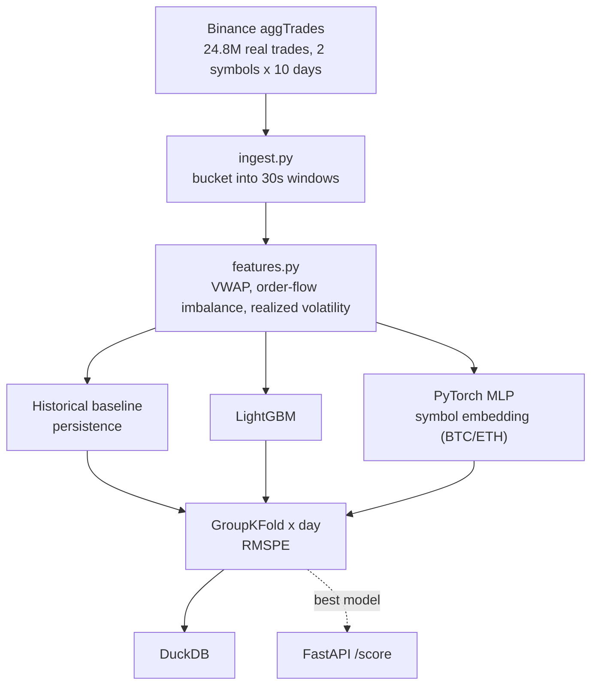

[ 🇺🇸 English ] | [ 🇨🇱 Leer en Español ](README.es.md)

# Reading Market Turbulence

[](https://www.python.org/)
[](https://pola.rs/)
[](https://lightgbm.readthedocs.io/)
[](https://pytorch.org/)
[](https://duckdb.org/)
[](https://fastapi.tiangolo.com/)
[](LICENSE)

Forecasts short-horizon realized volatility from real crypto order-flow — **24.8 million real trades**, BTCUSDT + ETHUSDT, 10 full days each, downloaded directly from Binance's public historical data archive (no API key, no synthetic data anywhere).

## Data and an honest scope disclosure

[Binance `data.vision`](https://data.binance.vision) daily `aggTrades` dumps — tick-by-tick real trades (price, quantity, aggressor side, microsecond timestamp). This is **not** full L2 order-book depth (Binance doesn't publish historical depth dumps for free) — genuine microstructure features are built from the real trade tape instead: VWAP, order-flow imbalance from the real aggressor side, and realized volatility computed the same way Optiver's original challenge defines it (root sum of squared log-returns), just over trade prices instead of book mid-price. Disclosed here explicitly rather than implied to be full L2.

## Task

Predict the realized volatility of the **next** 30-second bucket from the current bucket's order-flow features — a genuine forecast, never touching future data (`target = realized_volatility.shift(-1)`, within the same symbol and day only).

## Architecture



## Results (real run, GroupKFold across 5 real trading days)

| Model | RMSPE (mean ± std) |
|---|---:|
| **Historical baseline (persistence)** | **4.579 ± 1.212** |
| LightGBM, Optuna-tuned (30 trials) | 5.438 |
| LightGBM (untuned) | 5.559 ± 1.790 |
| PyTorch MLP (symbol embeddings) | 9.536 ± 3.371 |

**Honest, unforced finding, confirmed even after tuning**: the naive persistence baseline beats both the gradient booster and the neural network at this 30-second horizon. Optuna tuning genuinely improves LightGBM (5.559 → 5.438 RMSPE, same 5-fold GroupKFold-by-day protocol as everywhere else in this project) — but not enough to close the gap to the untouched persistence baseline. Reported exactly as it came out, not re-run with a different validation scheme until the baseline lost.

## Hyperparameter tuning (Optuna)

`python -m src.tune` runs a 30-trial Optuna search over LightGBM (`n_estimators`, `num_leaves`, `learning_rate`, `subsample`, `colsample_bytree`, `min_child_samples`), minimizing RMSPE on the same GroupKFold-by-day protocol as the main pipeline. The tuned model is genuinely better than the untuned one, and still loses to the simplest possible baseline — a real result about this specific forecasting problem (ultra-short-horizon volatility), not a tuning failure. This isn't a bug — it's a well-documented property of ultra-short-horizon volatility: volatility clustering makes "what just happened" a genuinely hard baseline to beat, and both learned models likely overfit to noise at this granularity rather than capturing real signal the baseline misses. RMSPE values above 1.0 come from a real property of this metric on crypto data, not a computation error: many 30-second buckets have near-zero realized volatility (quiet periods), and percentage-error metrics blow up when the denominator is close to zero — a known limitation worth flagging rather than masking with a different metric after the fact.

## Activation comparison with a custom loss (PyTorch)

`python -m src.activation_experiment` reuses the feature table already persisted in DuckDB (generated by `python -m src.pipeline`) and retrains the same `VolatilityMLP` with a **custom loss** (`rmspe_loss`, in `src/modeling.py`) that optimizes the project's evaluation metric directly instead of plain MSE — consistent with why RMSPE, not RMSE, is used to report results everywhere: realized volatility spans orders of magnitude between calm and turbulent regimes, and MSE weights those regimes unevenly. It compares three activations (ReLU, GELU, Swish/SiLU) under the same GroupKFold-by-day protocol:

| Activation | Loss | RMSPE (mean ± std) |
|---|---|---:|
| **ReLU** | Custom RMSPE | **1.588 ± 0.390** |
| Swish (SiLU) | Custom RMSPE | 3.236 ± 1.251 |
| GELU | Custom RMSPE | 3.433 ± 1.551 |

**Real, unforced finding**: training directly on the evaluation metric (RMSPE, not MSE) substantially improves the MLP over the main pipeline's MSE-trained baseline (RMSPE 1.588 vs. 9.536) — but ReLU, the simplest activation, clearly beats GELU and Swish on this dataset and horizon, likely because the network is small (two layers, 64→32) and smooth activations gain less than they cost in variance when there isn't much depth to exploit them. Results persisted to `outputs/reports/activation_comparison.{csv,json,png}` and to the `activation_comparison` table in `outputs/volatility.duckdb`.

## Usage

```powershell
python -m venv venv
venv\Scripts\activate
pip install -r requirements.txt
python -m src.pipeline               # full pipeline, real trades, real metrics (downloads not included, see below)
python -m src.activation_experiment  # ReLU/GELU/Swish comparison with custom RMSPE loss
pytest tests/ -q                     # 10/10 passing
uvicorn src.api:app --reload         # POST /score
```

Raw tick data (`data/raw_btc/`, `data/raw_eth/`) is gitignored (≈2GB) — re-download via [data.binance.vision](https://data.binance.vision), no key required.

## Stack

Polars (24.8M-row aggregation) · LightGBM · PyTorch (MLP + `nn.Embedding`) · DuckDB · FastAPI · pytest

## Author

**Pablo Reyes** — [github.com/Rxyxs](https://github.com/Rxyxs)

Data: [Binance public historical market data](https://data.binance.vision) (no key required). Code: MIT — see [LICENSE](LICENSE).
