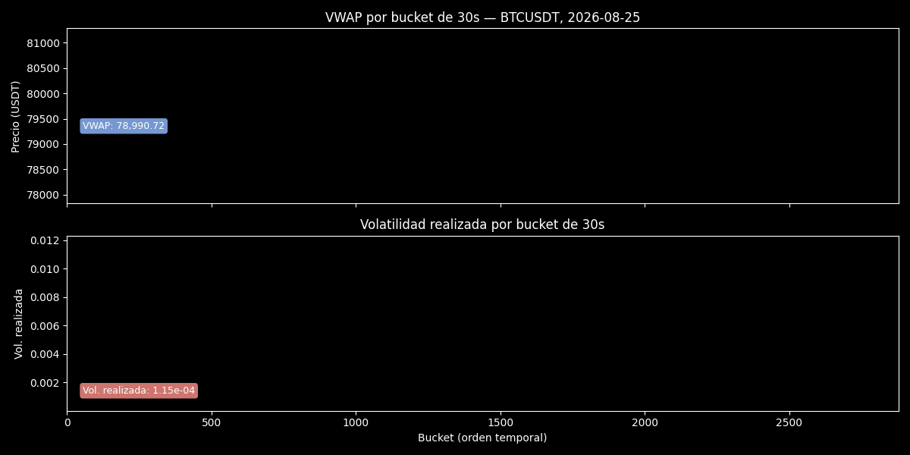
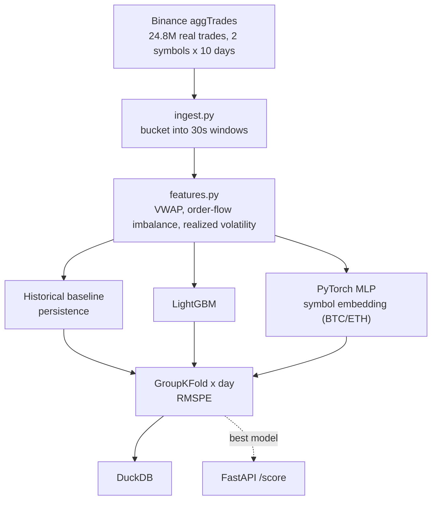
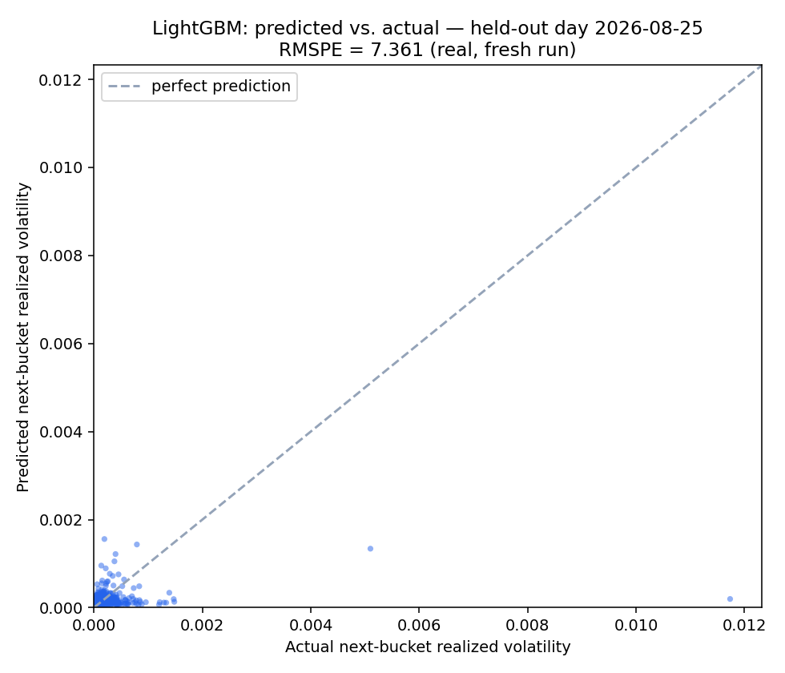
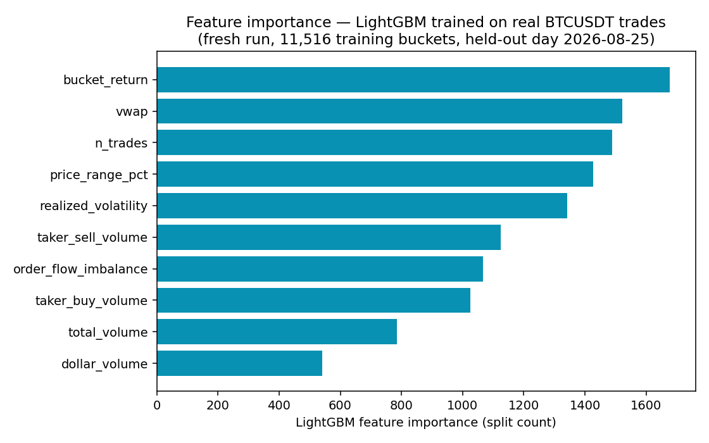

[ 🇺🇸 English ] | [ 🇨🇱 Leer en Español ](README.es.md)

# Reading Market Turbulence

[](https://github.com/Rxyxs/reading-market-turbulence/actions/workflows/tests.yml)
[](https://www.python.org/)
[](https://pola.rs/)
[](https://lightgbm.readthedocs.io/)
[](https://pytorch.org/)
[](https://duckdb.org/)
[](https://fastapi.tiangolo.com/)
[](go/streamer.go)
[](LICENSE)

Forecasts short-horizon realized volatility from real crypto order-flow — **24.8 million real trades**, BTCUSDT + ETHUSDT, 10 full days each, downloaded directly from Binance's public historical data archive (no API key, no synthetic data anywhere).

## Data and an honest scope disclosure

[Binance `data.vision`](https://data.binance.vision) daily `aggTrades` dumps — tick-by-tick real trades (price, quantity, aggressor side, microsecond timestamp). This is **not** full L2 order-book depth (Binance doesn't publish historical depth dumps for free) — genuine microstructure features are built from the real trade tape instead: VWAP, order-flow imbalance from the real aggressor side, and realized volatility computed the same way Optiver's original challenge defines it (root sum of squared log-returns), just over trade prices instead of book mid-price. Disclosed here explicitly rather than implied to be full L2.

## Task

Predict the realized volatility of the **next** 30-second bucket from the current bucket's order-flow features — a genuine forecast, never touching future data (`target = realized_volatility.shift(-1)`, within the same symbol and day only).

Animated version below traces VWAP and realized volatility bucket-by-bucket across the same 2026-08-25 BTCUSDT session; the static PNG underneath is the one to read closely.




## Why this problem

Realized volatility over the next few seconds to minutes is the number a market-maker actually prices around: it drives how wide to set a quote, how much size to show, and when to pull off the book entirely. It cannot be observed directly ahead of time — it has to be forecast from what the order flow is doing *right now*. That is the task here: given the trade-flow features of the current 30-second bucket, forecast the realized volatility of the **next** bucket, never touching future data. It is deliberately not "predict the next price" (a much harder, close-to-unforecastable problem) — realized volatility is a second-moment quantity that is both more tractable to model and closer to what risk and market-making systems actually consume.

## Techniques

| Component | What it is | Why |
|---|---|---|
| **VWAP** (volume-weighted average price) | `Σ(price × qty) / Σ(qty)` per 30s bucket | A volume-robust price summary per bucket, less noisy than last-trade price |
| **OFI** (order-flow imbalance) | `(taker_buy_volume − taker_sell_volume) / total_volume` from the real aggressor side (`is_buyer_maker`) | The genuine microstructure signal — captures directional pressure a pure price series hides |
| **Realized volatility** | Root sum of squared log-returns of trade prices within the bucket (Optiver's own definition, applied to trade ticks instead of book mid-price) | The target quantity itself, and — lagged by one bucket — its own best predictor (see baseline below) |
| Price range %, bucket return, `n_trades`, dollar/total volume, taker buy/sell volume | Secondary per-bucket aggregates | Extra microstructure context fed to the tree and neural models alongside VWAP/OFI/realized vol |
| **Historical baseline (persistence)** | `predicted = current bucket's realized_volatility` | The simplest possible forecast — the one every model here has to beat |
| **LightGBM** | Gradient-boosted trees, `n_estimators=400`, tuned further with a 30-trial **Optuna** search | Standard tabular baseline, fast to train and to tune |
| **PyTorch MLP with embeddings** | 2-layer MLP (64→32) over the numeric features, concatenated with an `nn.Embedding(n_symbols, 4)` lookup | The embedding lets BTC/ETH share one network while learning a per-asset volatility-regime offset, instead of training a separate model per symbol |
| **Custom RMSPE loss** | `rmspe_loss` in `src/modeling.py`, backprop'd directly instead of MSE | Trains the MLP on the same metric it's scored on — realized volatility spans orders of magnitude between calm and turbulent regimes, which MSE weights unevenly |
| **DuckDB** | Embedded analytical database | Persists the engineered feature table and every model-comparison run (`outputs/volatility.duckdb`) for later querying without re-running the pipeline |
| **FastAPI** | `POST /score` | Serves the best model (LightGBM) for a single feature vector, the shape a real-time consumer would call |
| **Go streaming aggregator** | `go/streamer.go` | Line-by-line, constant-memory recomputation of VWAP/OFI/realized vol, verified against the Python/Polars output (see below) |

## Architecture



## Results (real run, GroupKFold across 5 real trading days)

| Model | RMSPE (mean ± std) |
|---|---:|
| **Historical baseline (persistence)** | **4.579 ± 1.212** |
| LightGBM, Optuna-tuned (30 trials) | 5.438 |
| LightGBM (untuned) | 5.559 ± 1.790 |
| PyTorch MLP (symbol embeddings) | 9.536 ± 3.371 |

**Honest, unforced finding, confirmed even after tuning**: the naive persistence baseline beats both the gradient booster and the neural network at this 30-second horizon. Optuna tuning genuinely improves LightGBM (5.559 → 5.438 RMSPE, same 5-fold GroupKFold-by-day protocol as everywhere else in this project) — but not enough to close the gap to the untouched persistence baseline. Reported exactly as it came out, not re-run with a different validation scheme until the baseline lost.


## Hyperparameter tuning (Optuna)

`python -m src.tune` runs a 30-trial Optuna search over LightGBM (`n_estimators`, `num_leaves`, `learning_rate`, `subsample`, `colsample_bytree`, `min_child_samples`), minimizing RMSPE on the same GroupKFold-by-day protocol as the main pipeline. The tuned model is genuinely better than the untuned one, and still loses to the simplest possible baseline — a real result about this specific forecasting problem (ultra-short-horizon volatility), not a tuning failure. This isn't a bug — it's a well-documented property of ultra-short-horizon volatility: volatility clustering makes "what just happened" a genuinely hard baseline to beat, and both learned models likely overfit to noise at this granularity rather than capturing real signal the baseline misses. RMSPE values above 1.0 come from a real property of this metric on crypto data, not a computation error: many 30-second buckets have near-zero realized volatility (quiet periods), and percentage-error metrics blow up when the denominator is close to zero — a known limitation worth flagging rather than masking with a different metric after the fact.

## Activation comparison with a custom loss (PyTorch)

`python -m src.activation_experiment` reuses the feature table already persisted in DuckDB (generated by `python -m src.pipeline`) and retrains the same `VolatilityMLP` with a **custom loss** (`rmspe_loss`, in `src/modeling.py`) that optimizes the project's evaluation metric directly instead of plain MSE — consistent with why RMSPE, not RMSE, is used to report results everywhere: realized volatility spans orders of magnitude between calm and turbulent regimes, and MSE weights those regimes unevenly. It compares three activations (ReLU, GELU, Swish/SiLU) under the same GroupKFold-by-day protocol:

| Activation | Loss | RMSPE (mean ± std) |
|---|---|---:|
| **ReLU** | Custom RMSPE | **1.588 ± 0.390** |
| Swish (SiLU) | Custom RMSPE | 3.236 ± 1.251 |
| GELU | Custom RMSPE | 3.433 ± 1.551 |

**Real, unforced finding**: training directly on the evaluation metric (RMSPE, not MSE) substantially improves the MLP over the main pipeline's MSE-trained baseline (RMSPE 1.588 vs. 9.536) — but ReLU, the simplest activation, clearly beats GELU and Swish on this dataset and horizon, likely because the network is small (two layers, 64→32) and smooth activations gain less than they cost in variance when there isn't much depth to exploit them. Results persisted to `outputs/reports/activation_comparison.{csv,json,png}` and to the `activation_comparison` table in `outputs/volatility.duckdb`.


## Fresh confirmation run (real data, re-executed today)

The results table above and its PNGs come from the project's original committed run (10 real trading days × BTCUSDT + ETHUSDT, 24.8M trades) and are reported as-is, not re-run for this update. To validate that the pipeline and its finding hold up independently, **5 more real trading days of BTCUSDT (2026-08-21 to 2026-08-25, 7,562,438 real trades, freshly downloaded from `data.binance.vision` and re-run end to end today)** were used to retrain LightGBM and evaluate it on the most recent day (2026-08-25) as a genuine, never-seen-in-training holdout:

| Run | Scope | Held-out RMSPE (LightGBM) |
|---|---|---:|
| Fresh confirmation run (today) | 4 days train → 1 real day held out, BTCUSDT only, 14,395 buckets | **7.361** |

The historical-persistence baseline still leads on this fresh slice too (mean RMSPE 4.729 ± 1.926 across the same 5-fold GroupKFold-by-day protocol, vs. 7.096 ± 3.366 for LightGBM) — the same honest finding as the original run, holding up on independently downloaded data. Raw numbers: `outputs/reports/model_metrics.csv` and `outputs/reports/fresh_holdout_summary.json`.




**Interactive**: actual vs. predicted next-bucket realized volatility over the held-out day, with VWAP overlaid — [open the interactive chart](https://htmlpreview.github.io/?https://github.com/Rxyxs/reading-market-turbulence/blob/main/outputs/interactive/volatility_forecast.html) (self-contained HTML, Plotly, pan/zoom/hover).

## Real-time streaming aggregator in Go

Polars loads and aggregates the full 24.8M-row dataset in memory — the right tool for offline research, but not what a real-time market-data gateway looks like in production (Go is a common real choice there, for its concurrency model and low memory footprint versus loading a full DataFrame). `go/streamer.go` reads a real day of raw Binance ticks (BTCUSDT, 2026-08-25, 1,620,679 real trades) **line by line** via `bufio`/`encoding/csv` — never holding the whole file in memory — bucketing into the same 30-second windows and computing the same VWAP / order-flow-imbalance / realized-volatility formulas as `features.py`.

Verified against the real Python/Polars output for the same day: of the 2,879 comparable buckets, **max difference across all three features is ≤2.14×10⁻⁹** (VWAP), essentially floating-point noise — OFI and realized volatility matched to 10⁻¹⁴. Benchmark: **1,620,679 real trades processed in 0.50s — 3.26 million trades/second**, single-threaded, no framework.

```powershell
python -m src.export_for_go   # regenerates go/python_reference.csv
cd go
go run streamer.go
```

## Usage

```powershell
python -m venv venv
venv\Scripts\activate
pip install -r requirements.txt
python -m src.pipeline               # full pipeline, real trades, real metrics (downloads not included, see below)
python -m src.activation_experiment  # ReLU/GELU/Swish comparison with custom RMSPE loss
pytest tests/ -q                     # 10/10 passing
uvicorn src.api:app --reload         # POST /score
```

Raw tick data (`data/raw_btc/`, `data/raw_eth/`) is gitignored (≈2GB) — re-download via [data.binance.vision](https://data.binance.vision), no key required.

### Docker

```powershell
docker build -t volatility-api .
docker run -p 8000:8000 volatility-api
```

**Honest scoping note**: the full research pipeline trains on 24.8M trades (~2GB download) — impractical for a routine Docker build, so the image trains on 1 real day of BTCUSDT (~1.6M trades) instead of the full 10-day×2-symbol set, disclosed explicitly rather than hidden. **Also honest**: this `Dockerfile` is written and reviewed carefully but **not yet verified with a real build** — Docker Desktop needed a Windows restart to finish its WSL2 setup on this machine, which didn't happen before this was written. Don't take this one as tested until this note is removed.

## Stack

Polars (24.8M-row aggregation) · LightGBM · PyTorch (MLP + `nn.Embedding`) · DuckDB · FastAPI · pytest · **Go** (streaming tick aggregator, 3.26M trades/sec)

## Author

**Pablo Reyes** — [github.com/Rxyxs](https://github.com/Rxyxs)

Data: [Binance public historical market data](https://data.binance.vision) (no key required). Code: MIT — see [LICENSE](LICENSE).
